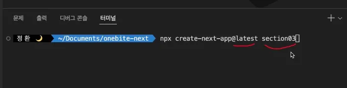
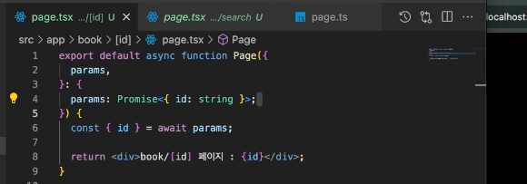
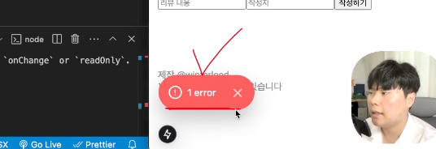
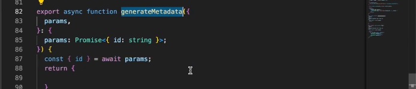

강의 업데이트) 위 변경사항을 반영하여 강의가 수정되었습니다.

위 변경사항을 반영하기 위해 일부 챕터(영상 클립)를 재녹화 하여 업데이트 해 두었습니다.
다음은 챕터별 변경 사항 안내입니다. 참고하셔서 일부 구간만 다시 확인하셔도 좋을 것 같습니다 😃

3.1) 앱라우터 시작하기

변경 시간 : 02분 26초 ~ 4분 29초 사이의 영상이 수정되었습니다.

변경 사항 : 이제 새로운 Next.js 앱을 생성할 때 RC 버전을 이용하지 않습니다. 이로 인해 앱 생성 명령어가 craete-next-app@rc에서 create-next-app@latest 으로 변경되었습니다.

3.2) 페이지 라우팅 설정하기

변경 시간 : 06분 16초 ~ 끝까지

변경 사항 : searchParams와 params는 이제 비동기로 제공됩니다. 따라서 강의에서 searchParams와 params를 다루는 방식이 변경되었습니다.

7.2) 리뷰 추가 기능 구현하기

변경 시간 : 14분 57초 ~ 16분 57초

변경 사항 : Next 15 버전부터는 콘솔에 단순한 경고로만 출력되던 메세지가 오버레이 형태로 등장합니다. 이에 따른 실습의 불편사항을 해소하기 위해 오류를 해결하는 방법에 대한 안내를 추가하였습니다.

9.2) 검색 엔진 최적화

변경 시간 : 07분 18초 ~ 끝까지

변경 사항 : searchParams와 params는 이제 비동기로 제공됩니다. 따라서 generateMetadat 함수에서 searchParams와 params를 다루는 방식도 변경되었습니다.

마치며

끝으로 그동안 여러분께서 보내주신 한입 Next.js를 향한 사랑과 관심에 항상 감사드립니다.

이런 여러분의 관심에 보답할 수 있도록 앞으로도 노력하겠습니다 🙇‍♂

날씨는 제법 춥지만, 따뜻한 마음으로 소식 보내드립니다.

항상 감사합니다.

이정환 드림